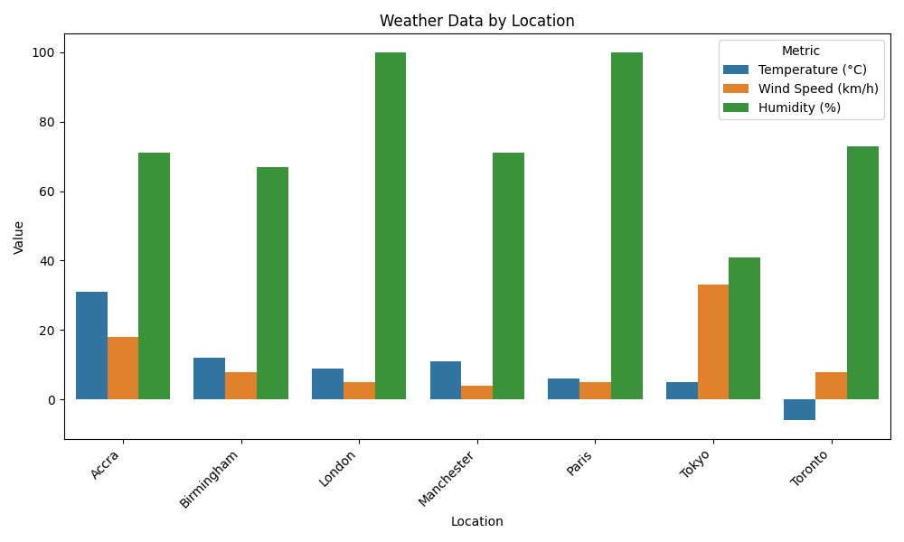

# Weather Data Pipeline

This project automates the process of fetching, processing, and visualizing weather data using the Weatherstack API.


1. **Data Fetching**: Using Weatherstack API to fetch real-time weather data.
2. **Data Processing**: Cleaning and organizing the data into a structured CSV format.
3. **Report Generation**: Creating visualizations to summarize weather conditions.

## Features
- Fetches data for multiple cities daily.
- Saves processed data as CSV.
- Generates a bar chart report.
- Fully automated with scheduling.

## How to Run
1. Clone this repository.
2. Install the dependencies:
   ```bash
   pip install -r requirements.txt


